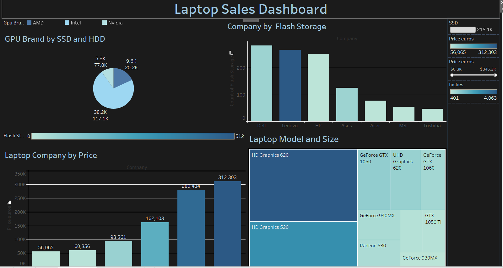

# Laptop Sales Dashboard

## Introduction
The **Laptop Sales Dashboard** is a powerful visualization tool designed to provide insights into laptop sales data. Developed using Tableau, this dashboard enables stakeholders to explore key metrics, identify trends, and make data-driven decisions. 

### Key Features:
- Interactive charts and graphs for real-time analysis.
- Overview of sales performance across different regions, brands, and time periods.
- Comparative analysis of product categories, pricing trends, and customer preferences.
- Drill-down capabilities for in-depth exploration of specific data points.

### Purpose:
The goal of this project is to simplify the interpretation of complex sales data, empowering decision-makers with a comprehensive view of the laptop sales landscape.

### Data Overview:
The dashboard is based on historical sales data, including:
- Sales figures by region and store.
- Brand performance and product category analysis.

